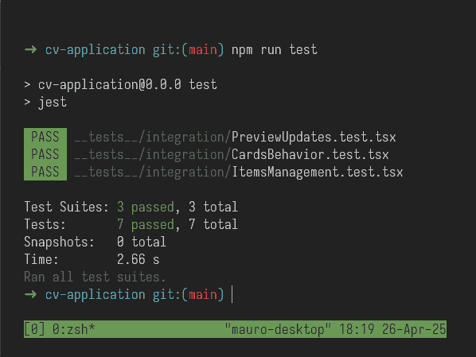

# CV Application

CV APP is a mobile-friendly React project designed for creating resumes. It features a live preview, and supports vectorized PDF generation.

## Preview

Live: https://cv-application-steel-eight.vercel.app/

## 🛠️ Technologies & Tools

- **Vite**
- **React**
- **TypeScript**
- **Zustand**
- **Jest**
- **React Testing Library (RTL)**
- **react-pdf/renderer**

## ✨ Key Features

- Real-time CV preview with live updates
- Download high-quality, selectable-text PDFs
- Add, edit, and delete multiple entries
- Clean, modular, and scalable codebase
- Comprehensive integration tests ensuring reliability

## 🧪 Testing Coverage

All main application flows are covered with automated tests using React Testing Library and Jest.

This project is based on The Odin Project Curriculum: https://www.theodinproject.com/
